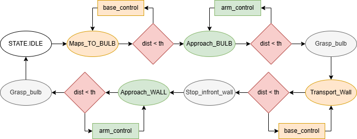

# Frankie Robot Simulation - Documentation

This directory contains the complete simulation framework for the Frankie mobile manipulator robot. The codebase is organized into **modular packages** that work together to provide different simulation scenarios.

## Table of Contents

1. [Overview](#overview)
2. [Project Structure](#project-structure)
3. [Core Components](#core-components)
4. [Simulation Scripts](#simulation-scripts)
5. [Utility Modules](#utility-modules)
6. [Architecture](#architecture)
7. [Usage](#usage)

---

## Overview

The simulation framework provides three main simulation scenarios:

1. **Basic Pick-and-Place** (`scripts/pick_and_place.py`) - Simple pick-and-place task without obstacles
2. **Obstacle Avoidance** (`scripts/obstacle_avoidance.py`) - Pick-and-place with random obstacles and A* path planning
3. **Maze Simulation** (`scripts/maze.py`) - Two-robot color sorting task in a procedurally generated maze

All simulations use the same core controller (`frankie/controller.py`) which implements a state machine for task execution.

---

## Project Structure

The project is organized into modular packages for better maintainability and reusability:

For detailed structure information, see [STRUCTURE.md](STRUCTURE.md).

---

## Core Components

### `frankie/controller.py`

**Purpose**: Main controller implementing the task execution state machine for the Frankie robot.

**Key Classes**:
- `TaskState` (Enum): Defines all possible states of the robot during task execution
  - `IDLE`, `NAVIGATE_IN_MAZE`, `NAVIGATE_TO_BULB`, `APPROACH_BULB`, `GRASP_BULB`
  - `TRANSPORT_TO_WALL`, `STOP_IN_FRONT_OF_WALL`, `APPROACH_WALL`, `SCREW_BULB`
  - `RETURN_TO_START`, `RESET`

- `FrankieControllerParams` (dataclass): Configuration parameters for the controller
  - Base control: `linear_velocity_gain`, `angular_velocity_gain`, `max_linear_velocity`, `max_angular_velocity`
  - Arm control: `arm_gain`, `pinv_damping`, `q_dot_limit`, `pos_tolerance`
  - Task parameters: `screw_rotations`, `grasp_height_offset`, `bulb_approach_distance`, etc.

- `FrankieController`: Main controller class
  - **Initialization**: Accepts `params`, `name`, `color_code`, and `use_base_motion` flag
  - **Key Methods**:
    - `set_bulb_position()`: Set target bulb position
    - `set_wall_fixture()`: Set wall fixture position and orientation
    - `set_world()`: Provide obstacle grid for path planning
    - `start_task()`: Initialize task execution
    - `compute_control()`: Main control loop - returns joint velocities and base commands
    - `is_task_complete()`: Check if task is finished

**Features**:
- Integrated A* path planning for obstacle avoidance
- Unicycle model for mobile base control
- Resolved-rate control with damped pseudoinverse for arm manipulation
- Automatic state transitions based on task progress
- Support for both mobile and stationary (arm-only) operation
- Smart orientation control: orientation control only active when screwing bulbs (prevents unwanted rotation during placement)
- Oscillation prevention: immediate stop when target position is reached to prevent end-effector shaking

---

## Simulation Scripts

### `scripts/pick_and_place.py`

**Purpose**: Basic pick-and-place simulation without obstacles.

**Features**:
- Simple workspace with wall and fixture
- Random bulb spawning
- Direct navigation (no path planning)
- Episode-based execution with metrics plotting

**Main Function**: `run_episode()`
- Spawns random bulb
- Runs simulation for fixed time (60 seconds)
- Generates metrics plots after completion

**Usage**: Run directly or via `launcher.py`

---

### `scripts/obstacle_avoidance.py`

**Purpose**: Pick-and-place simulation with random obstacles and A* path planning.

**Features**:
- Random cylindrical obstacles generated via `generators/obstacle_generator.py`
- A* path planning for navigation around obstacles
- Waypoint visualization (green for bulb path, blue for wall path, red for home path)
- Continuous episode execution (new episode starts when simulation time ends)

**Key Components**:
- `FrankieAgent`: Robot model wrapper (from `frankie/agent.py`)
- `obstacles_to_world_grid()`: Converts obstacles to grid for path planning
- `visualize_waypoints()`: Draws path markers and connecting lines
- Path visualization with different colors for different phases

**Main Function**: `run_episode()`
- Generates obstacles using `get_obstacles()`
- Converts obstacles to world grid
- Spawns bulb avoiding obstacles
- Runs simulation with path visualization
- Robot returns home after screwing using A* waypoints (red path visualization)
- Robot follows waypoints during return-to-home to avoid obstacles
- Generates metrics plots with obstacle map visualization (instead of standard trajectory plot)

**Usage**: Run directly or via `launcher.py`

**Plotting**: Uses `plot_episode_metrics()` with `obstacles` and `world_bounds` parameters to generate obstacle map visualization showing obstacles as purple circles with robot trajectory overlay.

---

### `scripts/maze.py`

**Purpose**: Two-robot maze simulation with color sorting.

**Features**:
- Procedurally generated maze using `generators/maze_generator.py`
- Two robots: "MazeGrasper" (R1) and "BulbScrewer" (R2)
- Color-coded bulbs (yellow, blue, green)
- R1 picks bulbs from maze and places on table
- R2 picks from table and screws into color-matched fixtures on wall
- Continuous task execution with automatic bulb respawning

**Key Components**:
- `FrankieAgent`: Robot model wrapper (from `frankie/agent.py`)
- `get_maze()`: Generates random maze
- Color-based task coordination between robots
- Episode-based execution (120 seconds per episode)

**Main Function**: `run_episode()`
- Generates maze
- Spawns robots and bulbs
- Coordinates two-robot task execution
- Generates separate metrics for each robot

**Usage**: Run directly or via `launcher.py`

---

## Utility Modules

### `core/algebra.py`

**Purpose**: Mathematical utilities and 3D vector operations.

**Key Components**:
- `Vector3` (dataclass): Immutable 3D vector class
  - Methods: `from_iterable()`, `to_numpy()`, `with_x/y/z()`, `norm()`, `normalized()`, `distance()`
  - Operators: `__add__`, `__sub__`, `__mul__`, `dot()`
- `wrap_angle()`: Wraps angle to [-π, π]
- `damped_pseudoinverse()`: Computes damped pseudoinverse for Jacobian
- `base_state_to_vector3()`: Converts base state to Vector3

**Import**: `from core.algebra import Vector3`

---

### `core/astar.py`

**Purpose**: A* pathfinding algorithm implementation.

**Key Components**:
- `Cell`: Internal class for A* algorithm cell representation
- `a_star_search()`: Main A* search function
  - **Input**: `grid` (2D list, 0=free, 1=obstacle), `src` (start cell), `dest` (goal cell)
  - **Output**: List of (row, col) tuples representing path, or `None` if no path found
  - **Features**: 8-directional movement, Euclidean distance heuristic

**Usage**: Used internally by `FrankieController` for path planning

**Import**: `from core.astar import a_star_search`

---

### `generators/obstacle_generator.py`

**Purpose**: Generate random obstacles for obstacle avoidance simulation.

**Key Components**:
- `Obstacle` (class): Represents a cylindrical obstacle
  - Attributes: `position`, `radius`, `height`
  - Methods: `contains_point()`: Check if point is inside obstacle
- `get_obstacles()`: Main function to generate random obstacles
  - **Parameters**: `world_bounds`, `num_obstacles`, `robot_base_pos`, `wall_position`, etc.
  - **Returns**: List of `Obstacle` objects
  - **Features**: Collision checking, minimum distance constraints, region-based placement
- `obstacles_to_world_grid()`: Converts obstacles to grid representation
  - **Input**: List of obstacles, world bounds, cell size
  - **Output**: numpy array (1=obstacle, 0=free space)
  - **Features**: Safety margin for robot size

**Import**: `from generators.obstacle_generator import Obstacle, get_obstacles, obstacles_to_world_grid`

---

### `generators/maze_generator.py`

**Purpose**: Generate procedurally generated mazes for maze simulation.

**Key Components**:
- `get_maze()`: Main function to generate maze
  - **Parameters**: `total_width`, `total_height`, `scale`, `lower_room_size`
  - **Returns**: numpy array (0=free, 1=wall, 2=barrier)
  - **Algorithm**: Recursive backtracking maze generation
- `_generate_base_maze()`: Generates base maze structure
- `_scale_maze_thin_walls()`: Scales maze to desired size
- `_add_outer_walls()`: Adds boundary walls
- `_add_barrier_around_walls()`: Adds safety barriers around walls

**Import**: `from generators.maze_generator import get_maze`

---

### `environments/maze.py`

**Purpose**: Build and manage maze environments in Swift 3D visualization.

**Key Components**:
- `Wall3D` (class): Represents a 3D wall with bounding box and visual object
  - Attributes: `min`, `max`, `visual`
  - Methods: `bounds()`: Get bounding box
- `Env` (class): Environment manager for Swift 3D visualization
  - **Initialization**: `Env(x_range, y_range, z, wall_height, swift_env)`
  - **Methods**: 
    - `add_wall(center, size, color, texture)`: Add a wall to the environment
  - Attributes: `walls`, `swift`
- `build_maze_scene()`: Build complete maze scene
  - **Parameters**: `env`, `max_tries`, `gap`, `show_path`, `wall_height`
  - **Returns**: `(grid, end_pos, start_pos)`
- `add_floor()`: Add floor to environment
- `place_walls_from_grid()`: Place walls from grid representation
- `find_bulb_valid_pos()`: Find valid bulb position near a point
- `find_bulb_pos()`: Find bulb position with minimum distance
- `to_world_pos()`: Convert grid to world coordinates
- `coords_to_map()`: Convert world to map coordinates

**Import**: `from environments.maze import Env, Wall3D, build_maze_scene`

---

### `plotting/basic.py` and `plotting/maze.py`

**Purpose**: Generate interactive plots for episode metrics.

**Key Function**:
- `plot_episode_metrics()`: Creates Plotly interactive HTML plots
  - **Input**: Time series data (states, positions, velocities, distances)
  - **Optional Parameters**: `obstacles`, `world_bounds` (for obstacle visualization)
  - **Output**: HTML file with interactive plots
  - **Features**: 
    - Task state timeline
    - Base and end-effector trajectories
    - Distance metrics
    - Velocity profiles
    - 2D top-down view with path visualization OR obstacle map (when obstacles provided)

**Imports**: 
- `from plotting.basic import plot_episode_metrics` (for basic simulations)
- `from plotting.maze import plot_episode_metrics` (for maze simulation)

---

### `plotting/obstacle.py`

**Purpose**: Obstacle visualization utilities for obstacle avoidance simulation.

**Key Function**:
- `plot_obstacles_2d()`: Creates 2D plot showing obstacles and robot trajectory
  - **Parameters**: 
    - `obstacles`: List of Obstacle objects
    - `world_bounds`: Tuple of (min_x, max_x, min_y, max_y)
    - `base_trajectory`: Optional robot trajectory array
    - `start_pos`, `bulb_pos_xy`, `wall_stop_pos`: Key position markers
  - **Output**: Plotly figure with obstacles (purple circles) and robot trajectory
  - **Features**:
    - Obstacles displayed as filled circles with radius
    - Robot trajectory overlay
    - Key position markers (start, bulb, wall stop)

**Import**: `from plotting.obstacle import plot_obstacles_2d`

**Usage**: Automatically used by `plot_episode_metrics()` when obstacles are provided, or can be called directly for custom visualizations.

---

### `frankie/agent.py`

**Purpose**: Robot agent wrapper for Swift visualization.

**Key Class**:
- `FrankieAgent`: Wraps robot model and handles Swift visualization
  - **Initialization**: `FrankieAgent(name, start_config, start_base_pose, fix_geometry=False)`
  - **Methods**: 
    - `register(env)`: Register robot with Swift environment
    - `base_state()`: Get current base pose [x, y, theta]
    - `apply_velocity_cmd(qdot, base_cmd, dt)`: Apply joint velocities and base commands

**Import**: `from frankie import FrankieAgent`

---

### `launcher.py`

**Purpose**: GUI launcher for selecting and running simulations.

**Features**:
- Tkinter-based GUI
- Three buttons for three simulation types:
  - Pick and Place (Basic)
  - Obstacle Avoidance (Advanced)
  - Maze Simulation (Two Robots)
- Cross-platform support (Windows, macOS, Linux)
- Opens each simulation in a new console window

**Usage**: Run `python launcher.py` to open the GUI

---

## Architecture

### Component Dependencies

```
scripts/pick_and_place.py
    ├── frankie/controller.py
    │   ├── core/algebra.py
    │   └── core/astar.py
    ├── frankie/agent.py
    └── plotting/basic.py

scripts/obstacle_avoidance.py
    ├── frankie/controller.py
    │   ├── core/algebra.py
    │   └── core/astar.py
    ├── frankie/agent.py
    ├── generators/obstacle_generator.py
    └── plotting/basic.py

scripts/maze.py
    ├── frankie/controller.py
    │   ├── core/algebra.py
    │   └── core/astar.py
    ├── frankie/agent.py
    ├── generators/maze_generator.py
    └── plotting/maze.py

launcher.py
    ├── scripts/pick_and_place.py
    ├── scripts/obstacle_avoidance.py
    └── scripts/maze.py
```

### State Machine Flow

The controller implements the following state flow:




**State Descriptions**:
- **IDLE**: Robot is ready, no active task
- **NAVIGATE_IN_MAZE**: Following A* waypoints through obstacle grid
- **NAVIGATE_TO_BULB**: Direct navigation to bulb (close range)
- **APPROACH_BULB**: Arm moving to bulb position
- **GRASP_BULB**: Lifting bulb from table
- **TRANSPORT_TO_WALL**: Base moving to wall with bulb
- **STOP_IN_FRONT_OF_WALL**: Base stopped, preparing arm approach
- **APPROACH_WALL**: Arm moving to fixture position
- **SCREW_BULB**: Rotating end-effector to screw bulb
- **RETURN_TO_START**: Base returning to home position (follows A* waypoints if obstacles present, otherwise direct navigation)
- **RESET**: Arm retracting to rest position

---

## Usage

### Running Simulations

#### Option 1: Using the Launcher (Recommended)

```bash
cd Project/git_actual
python launcher.py
```

Click on one of the three buttons to start the corresponding simulation.

#### Option 2: Direct Execution

```bash
# From project root (git_actual/)
# Basic pick-and-place
python scripts/pick_and_place.py

# Obstacle avoidance
python scripts/obstacle_avoidance.py

# Maze simulation
python scripts/maze.py
```

